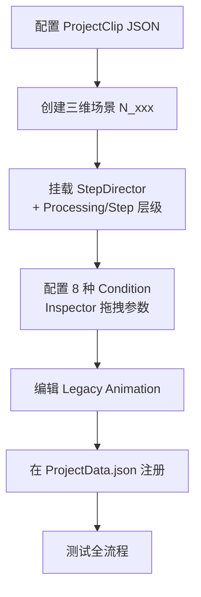

# 新增实验指南

## 概述

从零新增一个实训项目（ProjectClip）的全流程。设计文档以流程图为主，操作级指南留待使用手册。

## 流程图



## 分步说明

### 1. 配置 ProjectClip JSON

在 `ProjectData.json` 的 `projectClips` 数组中新增 Clip。配置所需 Task（允许少于 6 个，不需要的设置为 null）：

```json
{
  "id": "clip_new",
  "displayName": "新实训项目",
  "tasks": {
    "purpose": { "id": "task_01", "displayName": "任务目的" },
    "lineConnection": { "id": "task_04", "displayName": "电路连接" },
    "test": { "id": "task_06", "displayName": "小测验" }
  }
}
```

### 2. 创建三维场景

- 命名：`3_xxx`、`4_xxx` 等，数字前缀按加载顺序递增
- 场景内交互物体挂 `InteractiveBase` 子类组件
- 物理碰撞用 `Collider`，交互检测用 `Interactive` Layer

### 3. 挂载 StepDirector

如需步骤系统（LineConnection / Training 类 Task）：
在场景根节点挂 `StepDirector`，按三级结构创建层级：

```
ProjectClip 根节点（挂 StepDirector）
  └── ProcessingObj_0
       ├── StepObj_0（挂 Condition 组件 + 目标引用）
       └── StepObj_1
```

**注意**：`siblingIndex` 决定执行顺序，Hierarchy 拖拽调整。

### 4. 配置 Condition

8 种 Condition 全预置，编辑时纯 Inspector 操作：
- 拖拽交互物体到 Condition 引用字段
- 配置 `activeObjs` / `inactiveObjs`
- 配置 `delay`（步骤间延迟）

**不需要写代码。**

### 5. 编辑动画

使用 Legacy Animation，步骤系统通过 `normalizedTime` 精确控制帧。

### 6. 注册到 ProjectData

确保 Clip 已在 `ProjectData.json` 的 `projectClips` 中注册，`currentClipId` 或外部通过 ID 跳转到该 Clip。

### 7. 测试

运行 `0_Setup` → 跳转到对应 N 场景 → 验证全流程。使用 StepDirector 调试面板（Play Mode）检查步骤状态。

→ [步骤系统](../Business/Step-System.md) | [JSON Schema](../Data/JSON-Schema.md)
