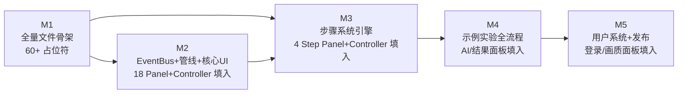

# Milestone 规划

> PM: CodeBuddy | 更新: 2026-07-06 v3
>
> 本文档将 Overview.md 中 8 阶段开发路线重构为 **5 个 Milestone**，补充子任务、验收标准和风险说明。
>
> **v3 更新**：M1 改为"全量文件骨架 + 占位符策略"——所有 Data / Panel / Controller 文件在 M1 全部出现（占位符），M2+ 逐模块填入实现。

## 路线总览

```
M1（全量文件骨架：Data+Panel+Controller，占位符）→ M2（EventBus+管线跑通）→ M3（步骤系统引擎）→ M4（示例实验全流程）→ M5（用户系统+发布）
```

**核心思想**：先把骨架搭满，杜绝"开发到一半发现缺文件"的问题。M1 产出约 60+ 个 `.cs` 文件，全部可编译（`Assembly-CSharp`），M2 开始逐个注入逻辑。

---

## M1: 全量文件骨架（占位符策略） 🔴 P0

> **目标**：项目中所有需要存在的 Data / Panel / Controller `.cs` 文件全部出现，用占位符实现。编译通过，架构蓝图可见。

### 背景

当前 MCV_Module 存在三个结构性问题：

| 问题 | 现状 | 影响 |
|------|------|------|
| **Panel 覆盖不够** | 仅 7 个空壳 Panel，Tuanjie 有 28 个 | M2-M4 开发中才发现缺 Panel，临时加文件破坏节奏 |
| **Controller 空白** | 0 个业务 Controller，MCV 的 C 层完全缺失 | 无法验证 MCV 架构；Panel 没有"大脑" |
| **数据层缺文件** | 缺 LineData / QuestionData / StepData | M3 步骤系统开发时数据模型还没建 |

**M1 的解决方案**：一次性铺满所有文件，每个文件里是带 `// TODO: Mx 实现` 的占位符。这样：
- 架构全貌立即可见
- 后续任何阶段都在已有文件中"填入"逻辑，不用新建文件
- 编译永远通过（占位符不破坏语法）

### 占位符规范

```csharp
// Data 占位符示例
[System.Serializable]
public class TaskPurposeData : TaskData<TaskPurposeData>
{
    // TODO: M1a 补充字段 —— 参考 Tuanjie TaskData_Purpose
    public override TaskType TaskType => TaskType.Purpose;
}

// Panel 占位符示例
public class TaskPurposePanel : PanelBase
{
    // TODO: M2 实现 —— 实验目的面板，展示 showContent / showModelPath
}

// Controller 占位符示例
public class TaskPurposeController : ControllerBase<TaskPurposePanel>
{
    // TODO: M2 实现 —— 绑定 TaskPurposeData → TaskPurposePanel
}
```

**占位符规则**：
1. 类声明、继承、命名空间正确
2. 基类要求的方法（如 `TaskType` getter）有最小实现
3. `// TODO: [Milestone] [简述]` 注释说明后续在哪个阶段填入
4. 编译通过（零 error）
5. `.meta` 文件随 `.cs` 文件提交

---

### M1a: Data 层文件清单

| # | 文件路径 | 操作 | 占位符 TODO 指向 |
|---|---------|------|-----------------|
| 1 | `Data/DataBase.cs` | 已存在 | — |
| 2 | `Data/Project/ProjectData.cs` | **修改**：TaskData 子类补字段 + ProjectClip 补构造 | M1a |
| 3 | `Data/Project/LineData.cs` | **新建** | M2 |
| 4 | `Data/Project/QuestionData.cs` | **新建** | M2 |
| 5 | `Data/Project/StepData.cs` | **新建** | M3 |
| 6 | `Data/Project/TaskDataConverter.cs` | **新建** | M2 |
| 7 | `Data/System/SystemData.cs` | 已存在 | — |
| 8 | `Data/User/UserData.cs` | 已存在 | — |
| 9 | `Data/Addressable/*.cs` | 已存在 | — |
| 10 | `Data/Json/JsonReaderWriter.cs` | 已存在 | — |

**M1a 实际编写任务**（其余为占位符）：

- `ProjectData.cs`：6 个 TaskData 子类补 `EquipmentData` / `PrincipleData` / `TipsData` / `SpeakingData` 字段 + `ProjectClip` 构造函数 + `GetTask()` 工厂方法
- `LineData.cs`：`LineConnectionData` + `ElementType` 占位符
- `QuestionData.cs`：`QuestionData` + `QuestionClip` + `QuestionItem` + `QuestionType` 占位符
- `StepData.cs`：`StepDataBase` + `StepConfig` + `ProcessingData` + `StepData` + `ConditionType` 占位符
- `TaskDataConverter.cs`：转换方法签名，空实现占位符

---

### M1b: Panel 层文件清单

> 参考 Tuanjie `F:\Project\Tuanjie_Structure\Assets\Scripts\UI\Panel\` 目录建立完整 Panel 集合。

#### 现有 Panel（7个，需改为占位符）

| # | 文件 | M1 操作 |
|---|------|--------|
| 1 | `UI/Panels/MenuPanel.cs` | 已有空壳，补 TODO 注释 |
| 2 | `UI/Panels/TitlePanel.cs` | 已有空壳，补 TODO 注释 |
| 3 | `UI/Panels/TaskPanel.cs` | 已有空壳，补 TODO 注释 |
| 4 | `UI/Panels/DialogPanel.cs` | 已有空壳，补 TODO 注释 |
| 5 | `UI/Panels/TipsPanel.cs` | 已有空壳，补 TODO 注释 |
| 6 | `UI/Panels/FunctionPanel.cs` | 已有空壳，补 TODO 注释 |
| 7 | `UI/Panels/CopyrightPanel.cs` | 已有空壳，补 TODO 注释 |

#### 新增 Panel（21个，均为占位符）

| # | 文件名 | 类名 | 用途 | TODO 指向 |
|---|--------|------|------|----------|
| 8 | `StartPanel.cs` | `StartPanel` | 启动/开始界面 | M2 |
| 9 | `LoadingPanel.cs` | `LoadingPanel` | 加载进度展示 | M2 |
| 10 | `LoginPanel.cs` | `LoginPanel` | 登录面板 | M5 |
| 11 | `LeftBottomPanel.cs` | `LeftBottomPanel` | 左下角任务/漫游切换 | M2 |
| 12 | `RightUpPanel.cs` | `RightUpPanel` | 右上角信息/快捷操作 | M2 |
| 13 | `RoamingBottomPanel.cs` | `RoamingBottomPanel` | 漫游模式底部控制栏 | M2 |
| 14 | `ControlInfoPanel.cs` | `ControlInfoPanel` | 操控说明 | M2 |
| 15 | `AiDialogPanel.cs` | `AiDialogPanel` | AI 对话 | M4 |
| 16 | `SleepTipsPanel.cs` | `SleepTipsPanel` | 休眠/超时提示 | M4 |
| 17 | `ResultSummitPanel.cs` | `ResultSummitPanel` | 实验结果提交与展示 | M4 |
| 18 | `RenderQualityPanel.cs` | `RenderQualityPanel` | 画质/渲染设置 | M5 |

#### 步骤系统 Panel（4个，占位符）

| # | 文件名 | 类名 | 用途 | TODO 指向 |
|---|--------|------|------|----------|
| 19 | `StepPanel.cs` | `StepPanel` | 步骤 UI 主面板 | M3 |
| 20 | `StepProcessingPanel.cs` | `StepProcessingPanel` | 步骤进度展示 | M3 |
| 21 | `StepQuestionPanel.cs` | `StepQuestionPanel` | 步骤内答题 | M3 |
| 22 | `StepToolPanel.cs` | `StepToolPanel` | 步骤内工具/器材 | M3 |

#### 任务专属 Panel（6个，占位符，对应 6 个 TaskType）

| # | 文件名 | 类名 | 对应 TaskType | TODO 指向 |
|---|--------|------|--------------|----------|
| 23 | `Task_PurposePanel.cs` | `TaskPurposePanel` | Purpose（实验目的） | M2 |
| 24 | `Task_EquipmentPanel.cs` | `TaskEquipmentPanel` | Equipment（实验仪器） | M2 |
| 25 | `Task_PrinciplePanel.cs` | `TaskPrinciplePanel` | Principle（实验原理） | M2 |
| 26 | `Task_LineConnectionPanel.cs` | `TaskLineConnectionPanel` | LineConnection（电路连接） | M2 |
| 27 | `Task_TrainingPanel.cs` | `TaskTrainingPanel` | Training（仿真实验） | M2 |
| 28 | `Task_TestPanel.cs` | `TaskTestPanel` | Test（小测验） | M2 |

**Panel 总计：28 个文件**（7 已有 + 21 新建）

---

### M1c: Controller 层文件清单

> 遵循 MCV 架构：每个 Panel 对应一个 Controller，继承 `ControllerBase<T>`，T 为对应 Panel 类型。

**文件夹**：`Assets/Scripts/Controllers/`（新建）

#### 核心 UI Controller（13个）

| # | 文件名 | 类名 | 绑定 Panel | TODO 指向 |
|---|--------|------|-----------|----------|
| 1 | `MenuController.cs` | `MenuController` | MenuPanel | M2 |
| 2 | `TitleController.cs` | `TitleController` | TitlePanel | M2 |
| 3 | `TaskListController.cs` | `TaskListController` | TaskPanel | M2 |
| 4 | `DialogController.cs` | `DialogController` | DialogPanel | M2 |
| 5 | `TipsController.cs` | `TipsController` | TipsPanel | M2 |
| 6 | `FunctionController.cs` | `FunctionController` | FunctionPanel | M2 |
| 7 | `CopyrightController.cs` | `CopyrightController` | CopyrightPanel | M2 |
| 8 | `StartController.cs` | `StartController` | StartPanel | M2 |
| 9 | `LoadingController.cs` | `LoadingController` | LoadingPanel | M2 |
| 10 | `LoginController.cs` | `LoginController` | LoginPanel | M5 |
| 11 | `LeftBottomController.cs` | `LeftBottomController` | LeftBottomPanel | M2 |
| 12 | `RightUpController.cs` | `RightUpController` | RightUpPanel | M2 |
| 13 | `RoamingBottomController.cs` | `RoamingBottomController` | RoamingBottomPanel | M2 |

#### 其他 Controller（5个）

| # | 文件名 | 类名 | 绑定 Panel | TODO 指向 |
|---|--------|------|-----------|----------|
| 14 | `ControlInfoController.cs` | `ControlInfoController` | ControlInfoPanel | M2 |
| 15 | `AiDialogController.cs` | `AiDialogController` | AiDialogPanel | M4 |
| 16 | `SleepTipsController.cs` | `SleepTipsController` | SleepTipsPanel | M4 |
| 17 | `ResultSummitController.cs` | `ResultSummitController` | ResultSummitPanel | M4 |
| 18 | `RenderQualityController.cs` | `RenderQualityController` | RenderQualityPanel | M5 |

#### 步骤系统 Controller（4个）

| # | 文件名 | 类名 | 绑定 Panel | TODO 指向 |
|---|--------|------|-----------|----------|
| 19 | `StepController.cs` | `StepController` | StepPanel | M3 |
| 20 | `StepProcessingController.cs` | `StepProcessingController` | StepProcessingPanel | M3 |
| 21 | `StepQuestionController.cs` | `StepQuestionController` | StepQuestionPanel | M3 |
| 22 | `StepToolController.cs` | `StepToolController` | StepToolPanel | M3 |

#### 任务专属 Controller（6个，对应 6 个 TaskType）

| # | 文件名 | 类名 | 绑定 Panel | TODO 指向 |
|---|--------|------|-----------|----------|
| 23 | `Task_PurposeController.cs` | `TaskPurposeController` | TaskPurposePanel | M2 |
| 24 | `Task_EquipmentController.cs` | `TaskEquipmentController` | TaskEquipmentPanel | M2 |
| 25 | `Task_PrincipleController.cs` | `TaskPrincipleController` | TaskPrinciplePanel | M2 |
| 26 | `Task_LineConnectionController.cs` | `TaskLineConnectionController` | TaskLineConnectionPanel | M2 |
| 27 | `Task_TrainingController.cs` | `TaskTrainingController` | TaskTrainingPanel | M2 |
| 28 | `Task_TestController.cs` | `TaskTestController` | TaskTestPanel | M2 |

**Controller 总计：28 个文件**（全部新建）

---

### M1 验收标准

1. **编译通过**：`Assembly-CSharp` 零 error（warning 可接受但应尽量零 warning）
2. **文件完整**：28 Panel + 28 Controller + 10 Data 文件全部存在
3. **继承正确**：每个 Panel 继承 `PanelBase`，每个 Controller 继承 `ControllerBase<T>`
4. **命名空间正确**：Data 在 `MCV_Module.Data.*`，Panel 在 `MCV_Module.UI.Panels`，Controller 在 `MCV_Module.Controller`
5. **占位符规范**：每个非空类有 `// TODO: [Mx] [简述]` 注释
6. **meta 文件**：所有新 `.cs` 文件有对应 `.meta` 文件纳入版本控制

### M1 风险

- **工作量**：~50 个新文件（占位符模式下每个文件 5-15 行），约 1-2 小时
- **命名一致性**：需确保 Panel 名和 Controller 名对应关系清晰（手动核对）

---

## M2: EventBus + 管线跑通（核心 UI 填入实现） 🔴 P0

> **目标**：M1 的占位符初步填入。EventBus 实现、场景加载管线跑通、核心 UI Panel + Controller 实现。

M2 结束时，下列文件从占位符变为真实实现：

### M2a: EventBus + 场景管线

| 子任务 | 填充文件 | 说明 |
|--------|---------|------|
| 2a.1 | `EventBus.cs`（新建） | 泛型 `Action<T>` 类型安全事件总线 |
| 2a.2 | `GlobalSceneMgr` | 异步 Additive 加载 + LoadingCanvas 过渡 |
| 2a.3 | `LoadingPanel.cs` + `LoadingController.cs` | 进度条更新 |

### M2b: 核心 UI Panel + Controller 实现（18 对）

| Panel | Controller | 实现要点 |
|-------|-----------|---------|
| `MenuPanel` | `MenuController` | 按钮动态生成、选择实验、退出 |
| `TitlePanel` | `TitleController` | 标题/描述/进度展示、功能按钮切换 |
| `TaskPanel` | `TaskListController` | 根据 ProjectClip 生成任务列表、状态更新 |
| `DialogPanel` | `DialogController` | 确认/取消对话框、事件驱动 |
| `TipsPanel` | `TipsController` | 提示文字、定时消失 |
| `FunctionPanel` | `FunctionController` | 功能按钮组初始化 |
| `CopyrightPanel` | `CopyrightController` | 版权信息展示 |
| `StartPanel` | `StartController` | 开始界面、进入主菜单 |
| `LeftBottomPanel` | `LeftBottomController` | 任务列表/漫游切换按钮 |
| `RightUpPanel` | `RightUpController` | 右上角快捷信息 |
| `RoamingBottomPanel` | `RoamingBottomController` | 漫游模式底部控制栏 |
| `ControlInfoPanel` | `ControlInfoController` | 操控说明展示 |
| `TaskPurposePanel` | `TaskPurposeController` | 实验目的图文展示 |
| `TaskEquipmentPanel` | `TaskEquipmentController` | 仪器列表展示 |
| `TaskPrinciplePanel` | `TaskPrincipleController` | 原理图文/视频展示 |
| `TaskLineConnectionPanel` | `TaskLineConnectionController` | 连线操作界面（依赖 M2c） |
| `TaskTrainingPanel` | `TaskTrainingController` | 仿真实验界面 |
| `TaskTestPanel` | `TaskTestController` | 小测验界面 |

### M2c: 交互系统落地

| 子任务 | 说明 |
|--------|------|
| 2c.1 | 连线端点交互 | LineConnect 命名编码配对 |
| 2c.2 | 拖拽元件交互 | InteractiveBase 子类 Drag 类型 |
| 2c.3 | 漫游 FPS Controller | MovementController 严格 MCV |

### M2 验收标准

1. 从 Setup 启动 → 主菜单 → 选择实验 → 进入漫游场景
2. WASD 移动 + 点击 3D 物体 → Panel 联动展示信息
3. EventBus 发布事件 → UI + Audio 模块同时响应
4. 连线端点配对正确
5. 6 个 Task 类型 Panel 均可展示对应数据

---

## M3: 步骤系统引擎 🟡 P1

> **目标**：Step System 核心引擎可用，8 种 Condition 全量落地，P0S0 快进。

**填充文件**：
- 数据层：`StepData.cs`（M1 占位符 → 完整字段定义）
- Panel 层：`StepPanel.cs` + `StepProcessingPanel.cs` + `StepQuestionPanel.cs` + `StepToolPanel.cs`
- Controller 层：`StepController.cs` + `StepProcessingController.cs` + `StepQuestionController.cs` + `StepToolController.cs`

### M3a — 引擎骨架

| 子任务 | 说明 | 依赖 |
|--------|------|------|
| 3a.1 | StepDataModel 细化 | 补全 StepConfig / ProcessingData / StepData / ConditionType | M1 |
| 3a.2 | StepDirector 执行器 | 三级驱动 + 三阶段生命周期（Prepare/Waiting/Complete） | 3a.1 |
| 3a.3 | GlobalStepSystemMgr | 注册到 Setup.cs 管线 | 3a.2 |
| 3a.4 | EventBus 集成 | 5 个 Step 事件发布到 EventBus | 3a.2, M2 |

### M3b — Condition 工厂

| 子任务 | 说明 | 依赖 |
|--------|------|------|
| 3b.1 | 基础 Condition（4 种） | Default / Click / UI / Finish | M3a |
| 3b.2 | 进阶 Condition（4 种） | Drag / Tool / Question / LineConnect | M3a |
| 3b.3 | P0S0 快进 | 工序0步骤0重置，快速执行到目标 | 3b.1 |
| 3b.4 | 边界情况 | Condition 超时、步骤跳过、状态清理 | 3b.2 |

### M3 验收标准

1. StepDirector 预制体拖入场景，配置 3 个 Step → Play 自动执行
2. StepPanel 实时显示进度，StepQuestionPanel 可答题
3. P0S0 快进：Step 5 → Step 2，从 Processing0 Step0 快速执行到目标

### 风险

- **高**：8 种 Condition 复杂度不同，LineConnect 联动连线子系统。M3a 完成后做 code review 再推进 M3b。

---

## M4: 示例实验全流程 + 内容管线 🟡 P1

> **目标**：配置一个完整实验，端到端验证。同时 `AiDialogPanel` / `SleepTipsPanel` / `ResultSummitPanel` 及其 Controller 从占位符填入实现。

**填充文件**：`AiDialogPanel.cs` + `AiDialogController.cs`、`SleepTipsPanel.cs` + `SleepTipsController.cs`、`ResultSummitPanel.cs` + `ResultSummitController.cs`

### 子任务

| # | 子任务 | 说明 | 依赖 |
|---|--------|------|------|
| 4.1 | 示例实验选题与设计 | 选"显微镜使用"或"电路连接"，设计 6 Task | — |
| 4.2 | 3D 场景与资源制作 | N_xxx 场景 + 模型 + UI 素材 | 4.1 |
| 4.3 | ProjectClip JSON 配置 | 6 Task 全链路数据填入 | 4.2 |
| 4.4 | Addressable 三策略验证 | AA / AB / Default 统一 API | M1 |
| 4.5 | 操作指南验证 | 按 `New-Experiment.md` 实操，修正文档 | 4.3 |

### 验收标准

1. Setup → 主菜单 → 完整 6 Task 流程 → 实验结束
2. 6 个 Task 类型全部正确展示
3. LoadingCanvas 过渡流畅，Addressable 各策略正确

---

## M5: 用户系统 + 发布就绪 🟢 P2（低优）

> **目标**：多用户、成绩记录、画质设置、打包发布。

**填充文件**：`LoginPanel.cs` + `LoginController.cs`、`RenderQualityPanel.cs` + `RenderQualityController.cs`

### 子任务

| # | 子任务 | 说明 |
|---|--------|------|
| 5.1 | 用户切换与数据隔离 | 多用户 profile |
| 5.2 | 成绩记录 | 评分逻辑 + JSON 持久化 |
| 5.3 | 画质设置 | RenderQualityPanel 实现 |
| 5.4 | CI 构建管线验证 | GitHub Actions build.yml |
| 5.5 | 性能优化 + 打包测试 | URP 14 调优 + Standalone 打包 |

---

## 里程碑依赖图



## 文件填充进度追踪

| Milestone | Panel 实现数 | Controller 实现数 | Data 实现数 | 累计占比 |
|-----------|:-----------:|:---------------:|:---------:|:------:|
| **M1** | 28（占位符） | 28（占位符） | 10 | 骨架 100% |
| **M2** | 18 填入 | 18 填入 | 6 填入 | ~60% |
| **M3** | 4 填入 | 4 填入 | 1 填入 | ~75% |
| **M4** | 3 填入 | 3 填入 | 0 | ~85% |
| **M5** | 2 填入 | 2 填入 | 0 | ~95% |
| **M1 存量** | 1（Copyright） | 1 | 3 | 骨架 |

> 注：M1 存量指不需要填入实现的简单文件（如 CopyrightPanel 只需一个 SetText 方法）。

---

## 优先级说明

| 级别 | 含义 | Milestone |
|------|------|-----------|
| 🔴 P0 | 阻塞项，必须最先完成 | M1, M2 |
| 🟡 P1 | 核心功能，P0 后推进 | M3, M4 |
| 🟢 P2 | 锦上添花，低优 | M5 |

---

## M1 涉及文件完整清单

### 新建文件（~50 个）

**Data 层（5 个）**：
```
Assets/Scripts/Data/Project/LineData.cs
Assets/Scripts/Data/Project/QuestionData.cs
Assets/Scripts/Data/Project/StepData.cs
Assets/Scripts/Data/Project/TaskDataConverter.cs
```

**Panel 层（21 个）**：
```
Assets/Scripts/UI/Panels/StartPanel.cs
Assets/Scripts/UI/Panels/LoadingPanel.cs
Assets/Scripts/UI/Panels/LoginPanel.cs
Assets/Scripts/UI/Panels/LeftBottomPanel.cs
Assets/Scripts/UI/Panels/RightUpPanel.cs
Assets/Scripts/UI/Panels/RoamingBottomPanel.cs
Assets/Scripts/UI/Panels/ControlInfoPanel.cs
Assets/Scripts/UI/Panels/AiDialogPanel.cs
Assets/Scripts/UI/Panels/SleepTipsPanel.cs
Assets/Scripts/UI/Panels/ResultSummitPanel.cs
Assets/Scripts/UI/Panels/RenderQualityPanel.cs
Assets/Scripts/UI/Panels/StepPanel.cs
Assets/Scripts/UI/Panels/StepProcessingPanel.cs
Assets/Scripts/UI/Panels/StepQuestionPanel.cs
Assets/Scripts/UI/Panels/StepToolPanel.cs
Assets/Scripts/UI/Panels/Task_PurposePanel.cs
Assets/Scripts/UI/Panels/Task_EquipmentPanel.cs
Assets/Scripts/UI/Panels/Task_PrinciplePanel.cs
Assets/Scripts/UI/Panels/Task_LineConnectionPanel.cs
Assets/Scripts/UI/Panels/Task_TrainingPanel.cs
Assets/Scripts/UI/Panels/Task_TestPanel.cs
```

**Controller 层（28 个）**：
```
Assets/Scripts/Controllers/MenuController.cs
Assets/Scripts/Controllers/TitleController.cs
Assets/Scripts/Controllers/TaskListController.cs
Assets/Scripts/Controllers/DialogController.cs
Assets/Scripts/Controllers/TipsController.cs
Assets/Scripts/Controllers/FunctionController.cs
Assets/Scripts/Controllers/CopyrightController.cs
Assets/Scripts/Controllers/StartController.cs
Assets/Scripts/Controllers/LoadingController.cs
Assets/Scripts/Controllers/LoginController.cs
Assets/Scripts/Controllers/LeftBottomController.cs
Assets/Scripts/Controllers/RightUpController.cs
Assets/Scripts/Controllers/RoamingBottomController.cs
Assets/Scripts/Controllers/ControlInfoController.cs
Assets/Scripts/Controllers/AiDialogController.cs
Assets/Scripts/Controllers/SleepTipsController.cs
Assets/Scripts/Controllers/ResultSummitController.cs
Assets/Scripts/Controllers/RenderQualityController.cs
Assets/Scripts/Controllers/StepController.cs
Assets/Scripts/Controllers/StepProcessingController.cs
Assets/Scripts/Controllers/StepQuestionController.cs
Assets/Scripts/Controllers/StepToolController.cs
Assets/Scripts/Controllers/Task_PurposeController.cs
Assets/Scripts/Controllers/Task_EquipmentController.cs
Assets/Scripts/Controllers/Task_PrincipleController.cs
Assets/Scripts/Controllers/Task_LineConnectionController.cs
Assets/Scripts/Controllers/Task_TrainingController.cs
Assets/Scripts/Controllers/Task_TestController.cs
```

### 修改文件（7 个）

```
Assets/Scripts/Data/Project/ProjectData.cs
Assets/Scripts/UI/Panels/MenuPanel.cs
Assets/Scripts/UI/Panels/TitlePanel.cs
Assets/Scripts/UI/Panels/TaskPanel.cs
Assets/Scripts/UI/Panels/DialogPanel.cs
Assets/Scripts/UI/Panels/TipsPanel.cs
Assets/Scripts/UI/Panels/FunctionPanel.cs
```

---

## 后续行动

1. **M1 立即启动**：按 M1a → M1b → M1c 顺序，生成全部占位符文件
2. **编译验证**：M1 生成完成后在 Unity Editor 中验证编译通过
3. **GitHub 管理**：在仓库创建 5 个 Milestone + 对应 Issues
