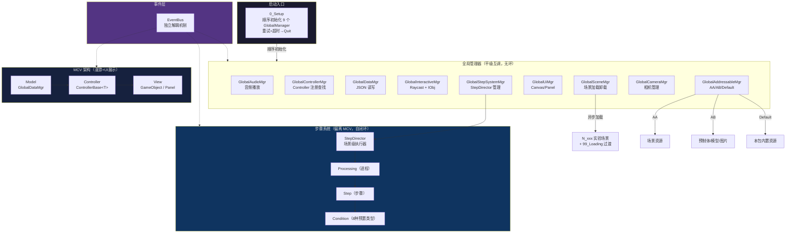

# MCV_Module 项目概要

> 文档驱动开发：先文档后代码，设计变更先更新文档。

## 定位

独立虚拟仿真实验教学产品，面向理工科（本科/专科/职业教育）。不绑定具体课程，任何实验均可通过配置 `ProjectClip`（实训项目）接入。

**技术栈**：Unity 2022.3.53f1 LTS + URP 14 + C#（.NET Standard 2.1）

团队：2-3 名开发。

---

## 架构总览



---

## 运行时场景管线

```
0_Setup → 1_Controller + 2_UI + N（三维实验场景）
           └── 99_Loading（过渡遮挡）
```

- **`0_Setup`**：启动入口，顺序初始化 9 个 GlobalManager，异步加载，重试超时后 `Application.Quit()`
- **`1_Controller`**：Controller 手动放置场景 + 手动注册到 `GlobalControllerMgr`
- **`2_UI`**：常驻 UI 层（CanvasBase 负责层级管理，Panel 栈管理单例，LoadingCanvas 始终顶层）
- **`N`**：具体实验的三维场景，按需异步加载卸载
- **`99_Loading`**：加载过渡遮挡，GlobalSceneMgr 统一驱动

---

## 业务形态

### 1. 漫游 → [详细文档](Business/Roaming.md)

FPS（WASD）+ 鼠标点击三维物体，通过 `GlobalInteractiveMgr` 统一射线检测。CharacterController 碰撞，配合 UI Panel 展示信息。严格遵循 MCV。

### 2. UI 展示 → [详细文档](Business/UI-Display.md)

图文、视频（计划 AVPro）、TextureReader 模型预览。纯 UI 驱动，重内容呈现。严格遵循 MCV。

### 3. 步骤系统 → [详细文档](Business/Step-System.md)

实验流程核心引擎。三级结构：**StepSystem → Processing（进程）→ Step（步骤）→ Condition（条件）**。
不完全遵循 MCV——采用预制体 + 预置 8 种 Condition，零代码编辑。P0S0 快进原则保证编辑便利性。
→ [设计决策](Decisions/Why-Prefab-Step.md)

---

## 资源加载策略

| 策略 | PackageType | 内容 | 说明 |
|------|:--:|------|------|
| Addressables | `AA` | 场景 | 异步加载，`99_Loading` 过渡 |
| AssetBundle | `AB` | 模型、预制体、图片 | 独立打包，无 version/dependencies |
| Resources | `Default` | 本包内置资源 | 零配置，启动必备 |

API：`GlobalAddressableMgr.LoadAsset<T>(string key, Action<T> onSuccess, Action<string> onFailure)`

→ [详细文档](Modules/Addressable.md) | [设计决策](Decisions/Why-Addressable.md)

---

## 架构决策

| 决策 | 状态 | 文档 |
|------|:--:|------|
| 自研 MCV 架构 | 已采纳，继续使用 | [Why-MCV](Decisions/Why-MCV.md) |
| 步骤系统预制体 + 零代码编辑 | 已采纳，核心设计原则 | [Why-Prefab-Step](Decisions/Why-Prefab-Step.md) |
| Addressable 三种策略共存 | 已采纳 | [Why-Addressable](Decisions/Why-Addressable.md) |
| EventBus 独立解耦 | 已确认 | 实现中 |
| Panel 单例 + 栈管理 | 已确认 | CanvasBase 负责 |

---

## 关键术语

| 术语 | 中文 | 含义 |
|------|------|------|
| **ProjectData** | 项目数据 | 系统级配置与实验片段列表 |
| **ProjectClip** | 实训项目 | 一个完整教学实验单元，包含若干 Task |
| **Task** | 实训任务 | 教学环节，对应一种 TaskType |
| **TaskData** | 任务数据 | 继承 `TaskDataBase`，分为图文/漫游/步骤三类 |
| **TaskType** | 任务类型 | Purpose → Equipment → Principle → LineConnection → Training → Test |
| **StepSystem** | 步骤系统 | 三级结构：Processing（进程）→ Step（步骤）→ Condition（条件） |
| **Condition** | 条件 | 8 种预置交互类型（Default/Click/Drag/Tool/UI/Question/LineConnect/Finish） |
| **MCV** | — | 自研架构，Model=GlobalDataMgr，Controller=ControllerBase\<T\>，View=GameObject/Panel |
| **PackageType** | — | Default(Resources)、AA(Addressables)、AB(AssetBundle) |
| **N 场景** | — | 具体实验的三维场景，按需 Additive 异步加载卸载 |
| **P0S0 快进** | — | 步骤跳转均从工序0步骤0重置并快速执行到目标 |

---

## 当前状态

| 模块 | 状态 |
|------|------|
| 全局管理器（9 个） | 框架搭建完成，GlobalStepSystemMgr 待实现 |
| 数据模型 | System/Project/User 定义完成，Step Data Model 待建 |
| MCV 模式 | IController/ControllerBase 定义完成，业务 Controller 待实现 |
| EventBus | 已确认引入，待实现 |
| UI 系统 | Canvas/Panel 基类与 7 个面板骨架完成 |
| 交互系统 | IObj/InteractiveBase 事件接口完成，按功能目的开放拓展 |
| Addressable | PackageConfigSO/Repository 完成，三策略加载待完善 |
| 步骤系统 | 设计明确（三级结构 + 8 Condition + P0S0），依赖基础模块，后开发 |
| 漫游系统 | 方案明确（FPS + CharacterController），代码参考 Tuanjie 项目 |
| 业务内容 | ProjectClip 6 任务数据类定义完成，实际实验内容为空 |

---

## 开发路线

**原则**：文档先行，基础模块优先，Step 系统依赖基础模块后开发。

| 阶段 | 内容 | 依赖 |
|------|------|------|
| 1 | 场景加载管线（异步 Additive + LoadingCanvas） | — |
| 2 | 漫游基础（FPS 移动 + 射线拾取 + Panel 联动） | GlobalInteractiveMgr |
| 3 | UI 展示能力（图文、视频、模型预览） | GlobalUiMgr |
| 4 | 交互系统落地（InteractiveBase 子类、连线端点、拖拽元件） | GlobalInteractiveMgr |
| 5 | EventBus 机制 | — |
| 6 | 步骤系统（8 种 Condition + StepDirector + P0S0 快进） | 阶段 2-5 |
| 7 | 示例实验全流程跑通 | 阶段 1-6 |
| 8 | 用户系统（登录、成绩、进度） | 低优 |

---

## 文档索引

| 分类 | 文档 | 说明 |
|------|------|------|
| **架构** | [MCV 模式](Architecture/MCV.md) | Model/Controller/View 职责边界 |
| | [场景管线](Architecture/Scene-Pipeline.md) | 0→1+2+N 异步加载机制 |
| | [全局管理器](Architecture/GlobalManager.md) | 9 个 GlobalManager 职责与初始化 |
| | [数据层](Architecture/Data-Layer.md) | DataBase 继承链与 JSON 持久化 |
| **业务** | [漫游系统](Business/Roaming.md) | FPS 移动 + 射线交互 + Panel 联动 |
| | [UI 展示](Business/UI-Display.md) | 图文/视频/模型预览 |
| | [步骤系统](Business/Step-System.md) | 3 级结构 + 8 Condition + P0S0 |
| | [连线子系统](Business/LineConnect.md) | LineGroup + 命名编码配对 + 共享元素锁定 |
| **模块** | [Addressable](Modules/Addressable.md) | AA/AB/Default 三种策略 |
| | [交互系统](Modules/Interactive.md) | IObj + InteractiveBase + 统一 Update |
| | [UI 框架](Modules/UI-Framework.md) | Canvas/Panel + 栈管理 + CanvasBase |
| | [用户系统](Modules/User-System.md) | 登录/进度/成绩（低优） |
| **数据** | [ProjectClip 规范](Data/ProjectClip-Spec.md) | 6 种 TaskData + 三类数据 |
| | [JSON Schema](Data/JSON-Schema.md) | 三份 JSON 字段定义 |
| | [枚举速查](Data/Enum-Reference.md) | TaskType、PackageType 等 |
| **指南** | [新增实验](Guides/New-Experiment.md) | ProjectClip 配置 → 场景制作 |
| | [新增 Panel](Guides/New-Panel.md) | 继承 PanelBase + Awake 注册 |
| | [新增交互](Guides/New-Interactive.md) | 继承 InteractiveBase + 按功能目的分类 |
| | [编码规范](Guides/Coding-Conventions.md) | 命名空间/序列化/协程约定 |
| **决策** | [Why-MCV](Decisions/Why-MCV.md) | 自研 MCV 的取舍 |
| | [Why-Prefab-Step](Decisions/Why-Prefab-Step.md) | 预制体 + 零代码编辑 |
| | [Why-Addressable](Decisions/Why-Addressable.md) | 三种策略共存的理由 |

---

## 命名约定

→ 详见 [编码规范](Guides/Coding-Conventions.md)

- 命名空间跟随文件夹：`MCV_Module.Data.Project`、`MCV_Module.GlobalManager`
- 数据类 `[Serializable]`，`SerializeField` 私有字段 + 公共属性
- 全局管理器通过 `SingletonGlobalMgr<T>.Instance` 访问
- 初始化逻辑写在各管理器的 `DelayInit()` 协程中
- 术语格式：ProjectClip（实训项目）——中文正文 + 英文括号标注
